<div align="center">

# 🧬 Pareto Frontier Multi-Agent Optimization for Clinical Trials

### 🔬 Evidence-grounded trial criteria drafting × 🧠 multi-objective SOP evolution

*A LangGraph-orchestrated team of clinical-trial specialists combines literature and regulatory retrieval with a local cohort-estimation workflow. A five-dimensional evaluation gauntlet scores each draft; an evolutionary outer loop mutates the Guild's standard operating procedure (SOP), and Pareto analysis surfaces non-dominated alternatives instead of hiding trade-offs behind one aggregate score.*

<br/>


<br/>

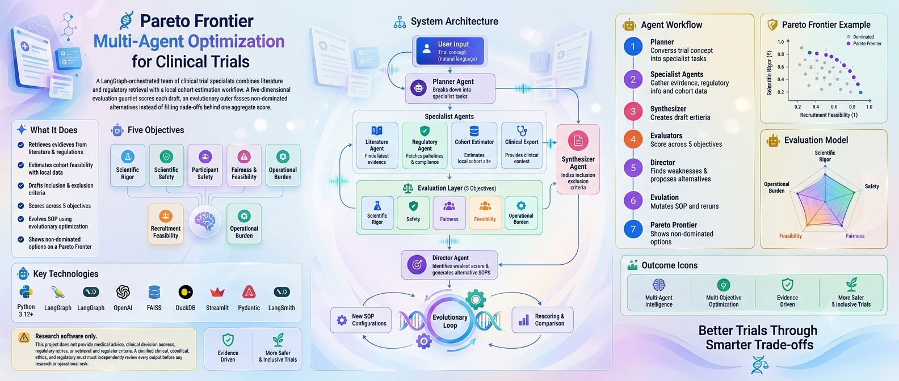

[🧭 Overview](#-overview) · [✨ Features](#-what-it-does) · [🏗️ Architecture](#%EF%B8%8F-system-architecture) · [🤖 Workflow](#-agent-workflow) · [📊 Evaluation](#-evaluation-model) · [🧬 Evolution](#-evolution-and-pareto-selection) · [🚀 Setup](#-quickstart) · [⚠️ Limitations](#%EF%B8%8F-limitations-and-responsible-use)

</div>

> [!CAUTION]
> **🩺 Research software only.** This project does not provide medical advice, clinical decision support, regulatory advice, or validated trial eligibility criteria. A qualified clinical, statistical, ethics, and regulatory team must independently review every output before any research or operational use.

---

## 📑 Table of contents

- [🧭 Overview](#-overview)
- [🌟 At a glance](#-at-a-glance)
- [✨ What it does](#-what-it-does)
- [🏗️ System architecture](#%EF%B8%8F-system-architecture)
- [🤖 Agent workflow](#-agent-workflow)
- [⏱️ A single run, step by step](#%EF%B8%8F-a-single-run-step-by-step)
- [🗄️ Evidence and cohort data flow](#%EF%B8%8F-evidence-and-cohort-data-flow)
- [📊 Evaluation model](#-evaluation-model)
- [🧬 Evolution and Pareto selection](#-evolution-and-pareto-selection)
- [🚀 Quickstart](#-quickstart)
- [⚙️ Configuration](#%EF%B8%8F-configuration)
- [▶️ Running the project](#%EF%B8%8F-running-the-project)
- [🛠️ Troubleshooting](#%EF%B8%8F-troubleshooting)
- [🗂️ Repository map](#%EF%B8%8F-repository-map)
- [🔐 Data, privacy, and reproducibility](#-data-privacy-and-reproducibility)
- [⚠️ Limitations and responsible use](#%EF%B8%8F-limitations-and-responsible-use)
- [🗺️ Roadmap ideas](#%EF%B8%8F-roadmap-ideas)
- [📖 Glossary](#-glossary)
- [❓ FAQ](#-faq)
- [🤝 Contributing](#-contributing)
- [📜 License](#-license)

---

## 🧭 Overview

Designing eligibility criteria requires balancing **evidence quality, participant safety, fairness, recruitment feasibility, and operational burden**. This project explores that problem as a **multi-agent workflow plus a multi-objective optimization problem**:

1. 🗺️ A **planner** turns a natural-language trial concept into specialist tasks.
2. 🔎 **Specialist agents** retrieve or calculate context relevant to those tasks.
3. ✍️ A **synthesizer** drafts inclusion and exclusion criteria.
4. ⚖️ **Evaluators** score the draft across five distinct objectives.
5. 🩻 A **director** diagnoses the weakest score and generates alternative SOP configurations.
6. 🔁 The candidates are rerun and rescored; **non-dominated SOPs** can be inspected on a Pareto frontier.

The shipped example request concerns a **Phase II Sotagliflozin study in adults with uncontrolled type 2 diabetes and CKD Stage 3**. The Streamlit UI accepts a trial concept, but the research sources, clinical mappings, and several assumptions in the implementation are currently tailored to this example.

### 🎯 Why Pareto instead of a single score?

A single weighted "fitness" number hides trade-offs. A trial design that is **scientifically rigorous** may be **hard to recruit for**; a design that is **operationally simple** may **weaken safety screening**. By keeping the five objectives separate, this project lets a human reviewer *see* the trade-offs and choose consciously.

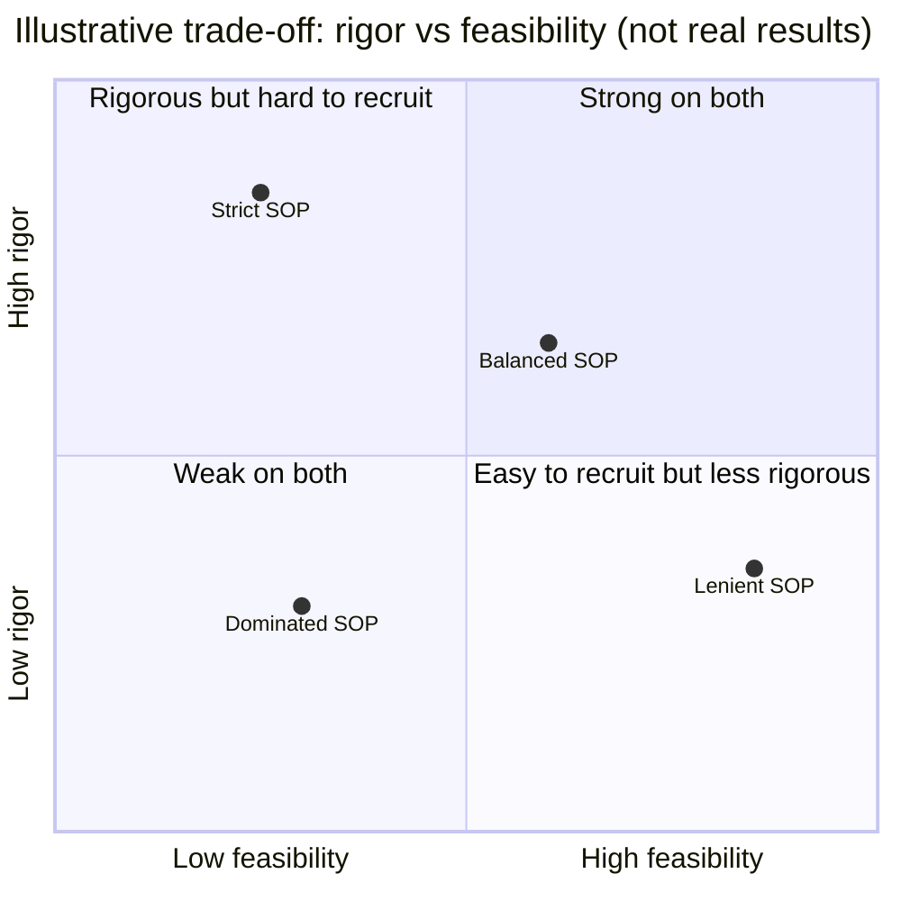

---

## 🌟 At a glance

| 🧩 Aspect | 📌 Detail |
| --- | --- |
| 🧠 **Orchestration** | LangGraph `StateGraph` with planner → specialists → synthesizer |
| 🤖 **Specialists** | Medical Researcher · Regulatory Specialist · Ethics Specialist · Patient Cohort Analyst |
| 📚 **Knowledge** | PubMed abstracts · FDA guidance text · Belmont summary (FAISS, in-memory) |
| 🧮 **Cohort data** | Local MIMIC-III CSV subset → DuckDB, queried via LLM-generated SQL |
| ⚖️ **Objectives** | Rigor · Compliance · Ethics · Feasibility · Simplicity |
| 🧬 **Optimization** | Director-led diagnosis + 2–3 SOP mutations per cycle |
| 🎯 **Selection** | Pareto non-dominated filtering (no scalar aggregation) |
| 🖥️ **Interfaces** | Streamlit app (`app.py`) and CLI demo (`main.py`) |

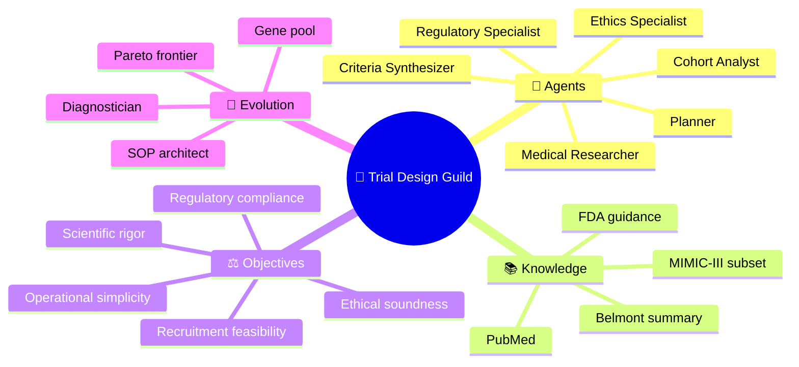

---

## ✨ What it does

- 🗺️ **Plans specialist work** using structured LLM output and a Pydantic task schema.
- 🔎 **Retrieves evidence** from local FAISS indexes built from PubMed abstracts, extracted FDA guidance text, and a generated Belmont Report summary.
- 🧮 **Estimates cohort size** by generating DuckDB SQL against a locally prepared MIMIC-III subset.
- ✍️ **Synthesizes a draft** inclusion/exclusion criteria document from specialist findings.
- ⚖️ **Scores drafts on five objectives**: scientific rigor, regulatory compliance, ethical soundness, recruitment feasibility, and operational simplicity.
- 🧬 **Evolves an SOP** through director-led diagnosis and 2–3 proposed SOP mutations per cycle.
- 🎯 **Preserves trade-offs** by identifying non-dominated candidates and plotting rigor-versus-feasibility plus parallel coordinates.
- 🖥️ **Provides a Streamlit interface** for drafting, evaluation, evolution, and frontier exploration, alongside a CLI demonstration.

---

## 🏗️ System architecture

The implementation has two entry points over shared pipeline components. Retrieval indexes are built in-process for a run; the SOP gene pool is held in application memory rather than persisted as a database.

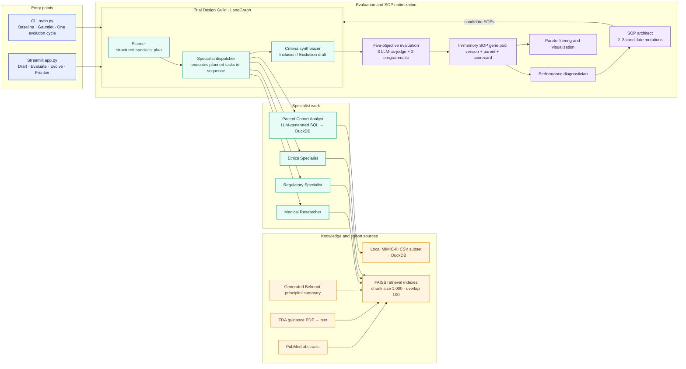

### 🧱 Architectural boundaries

- 🔵 The **inner loop** performs one draft: plan → specialist execution → synthesis.
- 🟣 The **outer loop** evaluates the draft and mutates the SOP; candidate SOPs trigger fresh inner-loop runs.
- 🚦 The dispatcher handles tasks one at a time, not in parallel. The planner schema contains task dependencies, but the current graph does not schedule work from those dependency fields.
- 💾 FAISS indexes are created from `.txt` files when the app/CLI initializes. The code does not persist or reload those indexes from disk.

### 🔄 The two nested loops

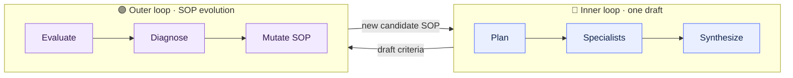

---

## 🤖 Agent workflow

A LangGraph `StateGraph` carries the request, SOP, plan, agent outputs, and final criteria. The specialist dispatcher chooses a handler based on the planned agent name; the ethics and cohort specialists can be disabled by SOP settings.

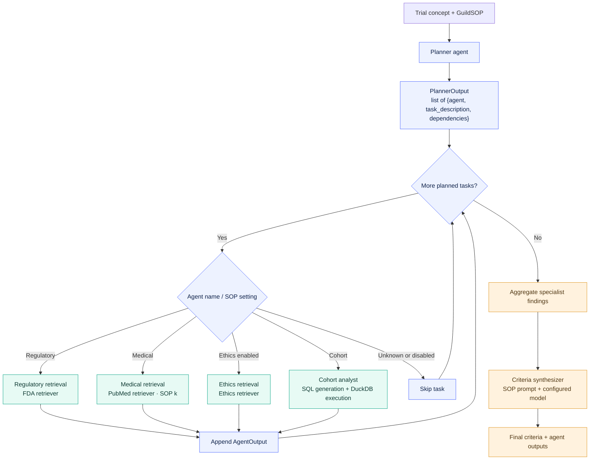

> [!IMPORTANT]
> **Implementation detail:** `dependencies` are represented in the planner's output schema but are **not enforced** by the dispatcher. Do not interpret a generated plan as a validated dependency graph or an audited clinical protocol.

### 👥 Meet the Guild

| 🎭 Agent | 🎯 Role | 📥 Data source | 🔧 Controlled by SOP? |
| --- | --- | --- | --- |
| 🗺️ **Planner** | Converts the trial concept into structured specialist tasks | Trial concept + SOP prompt | Prompt |
| 🩺 **Medical Researcher** | Retrieves clinical literature context | PubMed FAISS index | Retrieval `k` |
| 🏛️ **Regulatory Specialist** | Retrieves regulatory guidance context | FDA guidance FAISS index | — |
| ⚖️ **Ethics Specialist** | Retrieves ethical principles context | Belmont summary FAISS index | Can be disabled |
| 📈 **Patient Cohort Analyst** | Writes SQL and estimates eligible patients | MIMIC-III subset in DuckDB | Can be disabled |
| ✍️ **Criteria Synthesizer** | Drafts inclusion/exclusion criteria | Aggregated specialist findings | Prompt + model option |

---

## ⏱️ A single run, step by step

The sequence below shows what happens when the Streamlit app or CLI drafts and scores one set of criteria.

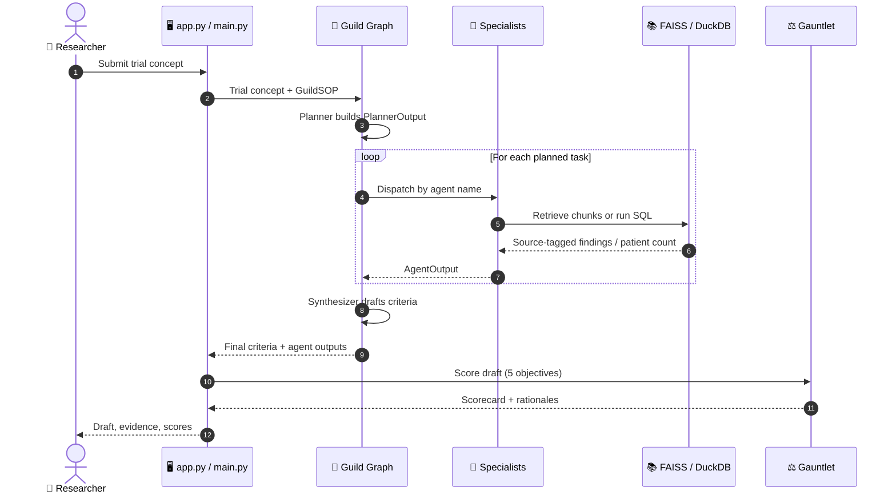

---

## 🗄️ Evidence and cohort data flow

The text sources are loaded from local files and embedded into separate in-memory FAISS stores. The cohort path is different: MIMIC-III CSVs are converted to a DuckDB database, and the cohort analyst asks the configured LLM to write a SQL query from the task and database schema.

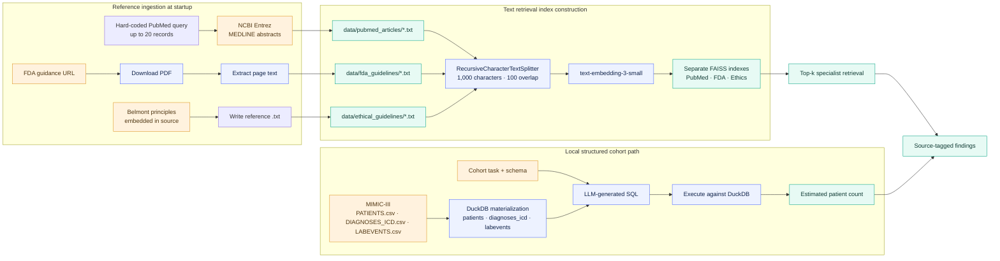

### 📥 Current data-source behavior

- 🧪 The PubMed loader requests up to **20 abstracts** for a hard-coded SGLT2 / type 2 diabetes / renal impairment query.
- 🏛️ The FDA guidance URL is hard-coded and differs between `main.py` and `app.py`; confirm that the selected document is the intended, current guidance before relying on it.
- ⚖️ The ethics source is a short, static Belmont-principles summary generated from code, not a live or comprehensive ethics corpus.
- 🗃️ The MIMIC loader expects the three named CSVs in the documented directory. In the current setup path, missing text corpora or an unavailable MIMIC database can prevent retriever construction or cohort analysis; treat these inputs as prerequisites for the full workflow.
- 🧾 The clinical-code and lab-value mappings used in the cohort prompt are simplified assumptions, not validated phenotyping logic.

### 🛡️ Where generated SQL sits in the trust boundary

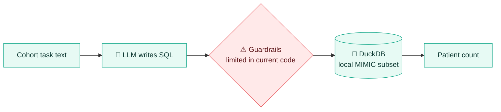

---

## 📊 Evaluation model

Each score is represented as a value from **0 to 1** plus a textual rationale. The project **does not collapse the five scores into a single fitness value** for Pareto comparison; it treats each as a separate maximization objective.

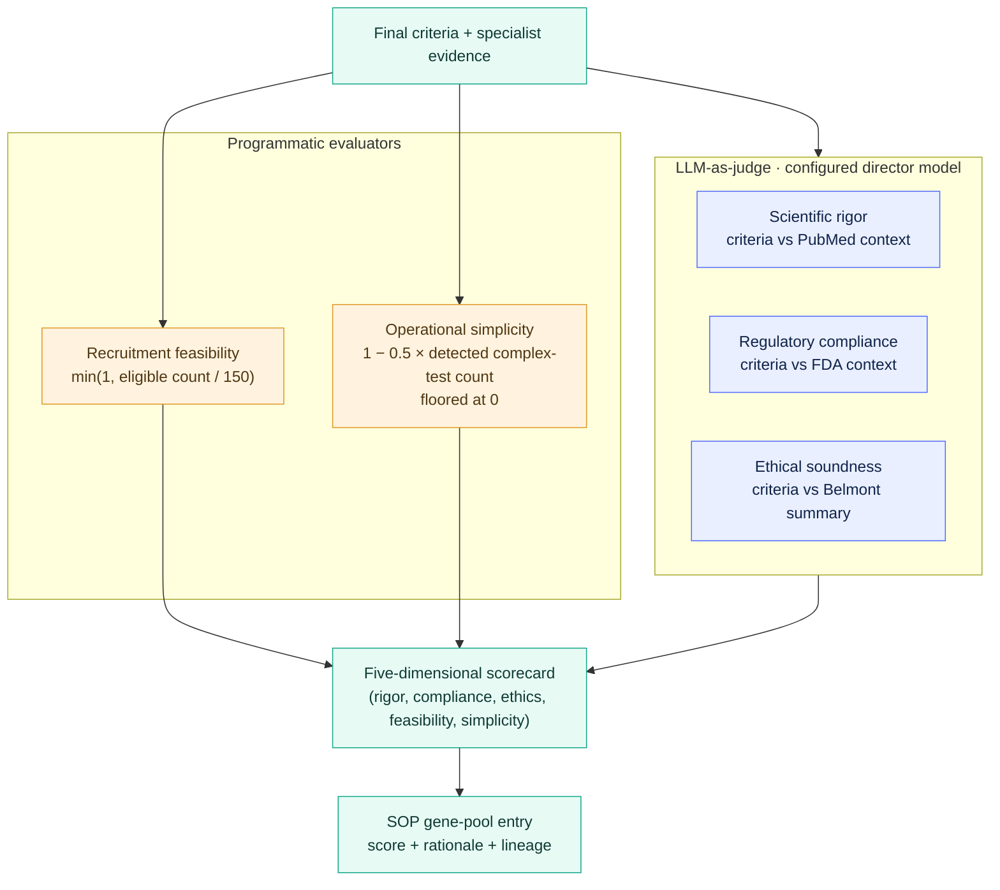

| 🎚️ Objective | ⚙️ Current implementation | ⚠️ Caveat |
| --- | --- | --- |
| 🔬 Scientific rigor | LLM judge compares draft with retrieved PubMed findings | Depends on the completeness and relevance of the retrieved abstracts and judge prompt |
| 🏛️ Regulatory compliance | LLM judge compares draft with retrieved FDA text | One hard-coded guidance source; not a legal or regulatory determination |
| ⚖️ Ethical soundness | LLM judge compares draft with the embedded Belmont summary | Short summary; does not replace an IRB or ethics review |
| 👥 Recruitment feasibility | Normalizes parsed eligible-patient count against a target of 150 | A simple proxy; input is an LLM-generated query and simplified MIMIC cohort logic |
| 🧰 Operational simplicity | Penalizes mentions of a fixed list of six procedures | Keyword heuristic; not a validated operational-cost model |

### 🧮 Scoring formulas

```text
feasibility = min(1, eligible_patient_count / 150)
simplicity  = max(0, 1 − 0.5 × detected_complex_test_count)
```

> [!NOTE]
> The cohort score parser expects a particular phrase in the analyst output. If that phrase is absent or its count cannot be parsed, the **feasibility score becomes zero**. Scores should therefore be interpreted as **prototype signals for comparison**, not calibrated metrics or clinical guarantees.

### 🧑‍⚖️ Judge types

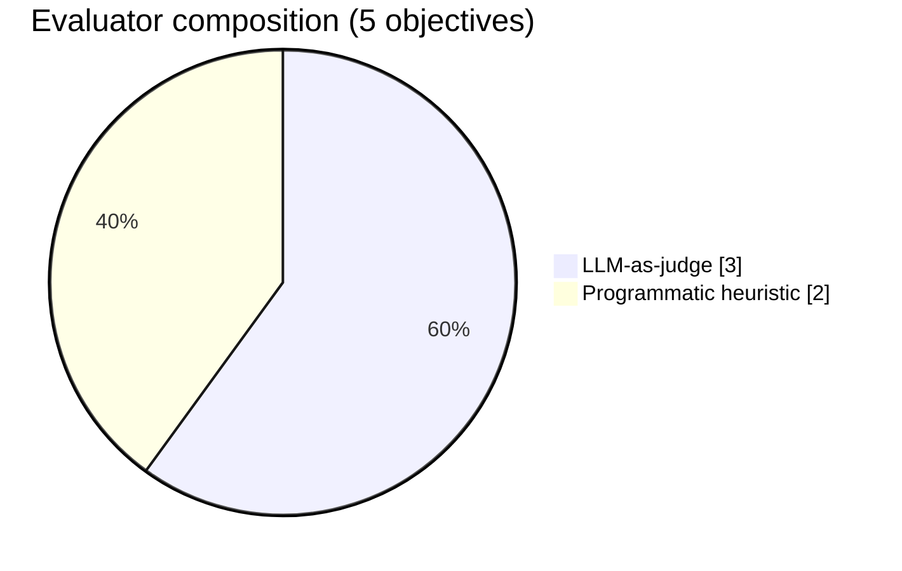

---

## 🧬 Evolution and Pareto selection

An evolution cycle selects the most recently added SOP, asks a diagnostician to identify the weakest pillar, and asks an architect for 2–3 mutations. Each mutation is rerun through the Guild and evaluation gauntlet, then added to the gene pool with its parent version. Pareto filtering runs across the collected pool.

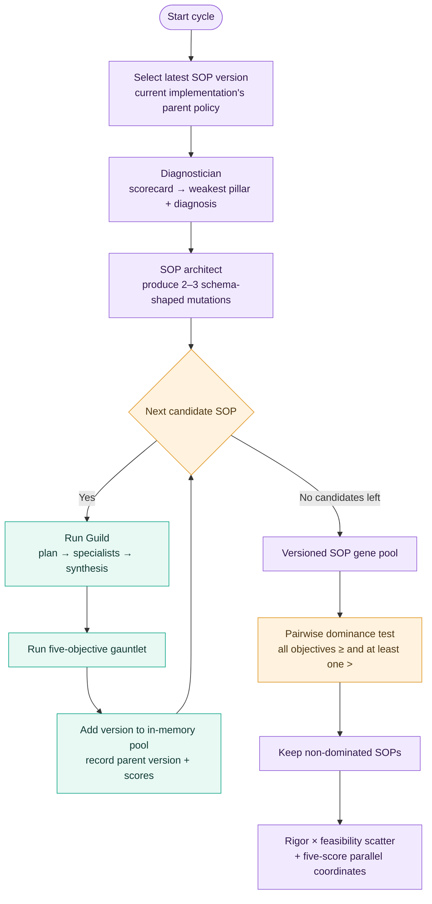

### 🧬 SOP gene-pool lineage

Every SOP version records its **parent**, its **scorecard**, and the **rationales**, so you can trace how a configuration was derived.

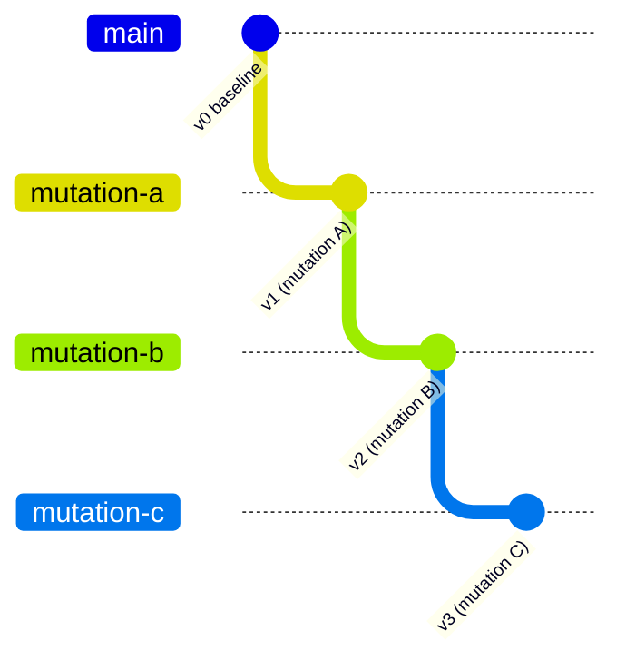

> 💡 The diagram above is an *illustrative* lineage. In the current implementation, each cycle picks the **latest** SOP as parent, not a chosen frontier member.

### 📐 Dominance rule

Candidate **A dominates B** when A is at least as good on every objective and strictly better on at least one. If neither candidate dominates the other, both may remain on the frontier—even when one has stronger rigor and the other has stronger feasibility.

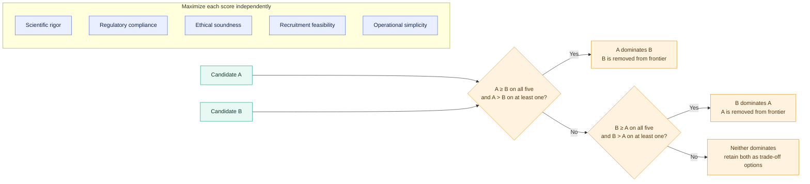

### 🧪 Worked example (illustrative numbers only)

| 🧬 SOP | 🔬 Rigor | 🏛️ Compliance | ⚖️ Ethics | 👥 Feasibility | 🧰 Simplicity | 🎯 Verdict |
| --- | :---: | :---: | :---: | :---: | :---: | --- |
| **v0** | 0.80 | 0.70 | 0.75 | 0.40 | 0.50 | ✅ Non-dominated (best rigor) |
| **v1** | 0.70 | 0.70 | 0.75 | 0.90 | 0.50 | ✅ Non-dominated (best feasibility) |
| **v2** | 0.65 | 0.65 | 0.70 | 0.85 | 0.50 | ❌ Dominated by v1 |

v2 is dominated because v1 is at least as good on every objective and strictly better on at least one. v0 and v1 both stay: neither beats the other across all five scores, so they represent a genuine **rigor ↔ feasibility trade-off**.

### 🚦 Candidate state during a cycle

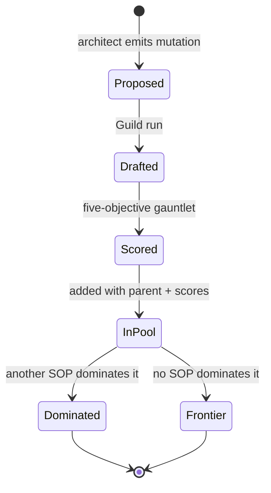

> [!WARNING]
> **This is an exploratory search, not a production-grade evolutionary optimizer.** The pool currently lives in memory, the cycle starts from the latest entry rather than a selected frontier member, and the CLI executes one cycle. No random seed, immutable run manifest, or persistent experiment store is configured.

---

## 🚀 Quickstart


### 1️⃣ Prerequisites

- 🐍 Python **3.12 or newer** (as declared by `pyproject.toml`).
- 🌐 Git and a working internet connection for NCBI PubMed, FDA source downloads, and OpenAI API calls.
- 🔑 An OpenAI API key with access to the configured chat and embedding models.
- 📧 An Entrez contact email for NCBI E-utilities.
- 📡 A LangSmith API key, if using the supplied environment template and tracing configuration.
- 🏥 Authorized local access to the required MIMIC-III files. MIMIC access is controlled by PhysioNet and its data-use requirements.

> [!NOTE]
> **Provider note:** `config/llm_foundry.py` instantiates OpenAI chat models and OpenAI embeddings. The Streamlit onboarding screen currently mentions Ollama and local model names, but that text does not match the implemented model configuration. Follow the OpenAI configuration below unless you first change the code.

### 2️⃣ Clone and create an environment

```bash
git clone https://github.com/paras160500/Pareto-Frontier-Multi-Agent-Optimization-for-Clinical-Trials.git
cd Pareto-Frontier-Multi-Agent-Optimization-for-Clinical-Trials

python3.12 -m venv .venv
source .venv/bin/activate                 # Windows PowerShell: .venv\Scripts\Activate.ps1
python -m pip install --upgrade pip
pip install -r requirements.txt
```

The repository has both a `requirements.txt` and a minimal `pyproject.toml`; the requirements file lists the runtime libraries. The project metadata currently declares no dependencies, so use `requirements.txt` for installation.

### 3️⃣ Configure environment variables

```bash
cp .env.example .env
```

Edit `.env` and supply real values:

```dotenv
OPENAI_API_KEY=your_openai_api_key
ENTREZ_EMAIL=you@example.org
LANGCHAIN_API_KEY=your_langsmith_api_key
LANGCHAIN_TRACING_V2=true
LANGCHAIN_PROJECT=AI_Clinical_Trials_Architect
```

| 🔑 Variable | 📝 Purpose | ❗ Required? |
| --- | --- | :---: |
| `OPENAI_API_KEY` | Chat and embedding models | ✅ |
| `ENTREZ_EMAIL` | NCBI E-utilities contact for the PubMed loader | ✅ |
| `LANGCHAIN_API_KEY` | LangSmith tracing; the loader expects the variable to exist | ✅ (may be empty if tracing is not configured) |
| `LANGCHAIN_TRACING_V2` | Enables LangSmith tracing | ➖ |
| `LANGCHAIN_PROJECT` | LangSmith project name | ➖ |

> [!WARNING]
> Do **not** commit `.env`, API keys, patient data, or downloaded MIMIC files. Set `LANGCHAIN_API_KEY` to an authorized key (or an empty value if tracing is not configured) rather than leaving it undefined.

### 4️⃣ Provide the MIMIC-III CSV subset

After obtaining access and downloading the files through the authorized PhysioNet process, place the expected files here (filenames are case-sensitive on Linux):

```text
data/
└── mimic_db/
    └── mimiciii_csvs/
        ├── PATIENTS.csv
        ├── DIAGNOSES_ICD.csv
        └── LABEVENTS.csv
```

The loader materializes a DuckDB database at `data/mimic_db/mimic3_real.db`. `LABEVENTS.csv` can be large and may take several minutes to process. Use only data you are authorized to access, and review your institution's data handling requirements before running the application.

---

## ⚙️ Configuration

The main model and workflow defaults are currently code-defined:

| 🎛️ Setting | 🔢 Current value | 📍 Location |
| --- | --- | --- |
| Planner / SQL coder / director chat model | `gpt-4o-mini` | `config/llm_foundry.py` |
| Embedding model | `text-embedding-3-small` | `config/llm_foundry.py` |
| Baseline synthesizer model | `gpt-4o-mini` | `guild/sop.py` |
| Alternative synthesizer schema option | `gpt-5-mini` | `guild/sop.py` |
| Medical retriever default top-k | `3` | `guild/sop.py` |
| PubMed retrieval top-k | SOP-controlled; baseline `3` | `guild/agents.py` |
| FDA retrieval top-k | Retriever default `3` | `data_pipeline/vector_store.py` |
| Ethics retrieval top-k | Retriever default `2` | `data_pipeline/vector_store.py` |
| Text chunk size / overlap | `1000` / `100` characters | `data_pipeline/vector_store.py` |

> [!TIP]
> Changing the synthesizer model option in the SOP does not reconfigure the planner, evaluator, embedding, or other model clients. Provider and model changes should be tested across all paths before use.

---

## ▶️ Running the project

### 🖥️ Streamlit application

```bash
streamlit run app.py
```

The interface guides you through **Draft → Evaluate → Evolve → Frontier**. Initialization downloads/builds the configured sources and indexes, then the app can draft criteria, inspect specialist outputs, score the latest draft, run one evolutionary cycle, and visualize non-dominated SOPs. The gene pool and current run state are in the Streamlit session; restarting the app does not provide durable experiment storage.

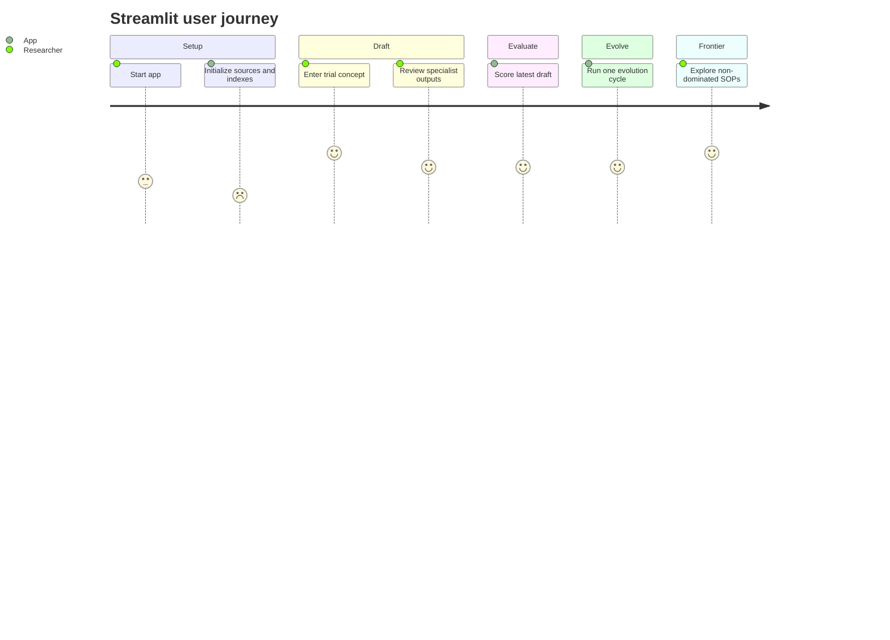

### 💻 CLI demonstration

```bash
python main.py
```

The CLI runs a fixed Sotagliflozin trial concept, builds the knowledge stores, performs a baseline draft and evaluation, seeds the SOP pool, runs one evolution cycle, prints scores and frontier versions, and writes `pareto_frontier.png` in the working directory when a frontier can be plotted.

### 🧪 FDA download smoke test

```bash
python sample_fda_test.py
```

This only tests the FDA PDF download/extraction helper; it is not an end-to-end application test suite.

---

## 🛠️ Troubleshooting

| 😵 Symptom | 🔍 Likely cause | ✅ Suggested check |
| --- | --- | --- |
| Startup error about `LANGCHAIN_API_KEY` | The environment loader expects the variable to exist | Set it to a real key, or to an empty value if not tracing |
| Cohort analysis fails or feasibility is `0` | MIMIC CSVs missing, wrong path, or analyst output lacks the phrase the parser expects | Confirm the three files and their **case-sensitive** names; inspect the cohort agent output |
| Retriever construction fails | Text corpora were not downloaded/created | Check `data/pubmed_articles`, `data/fda_guidelines`, `data/ethical_guidelines` |
| Ollama mentioned on the onboarding screen but errors mention OpenAI | UI text does not match the model factory | Use the OpenAI configuration unless you change `config/llm_foundry.py` |
| Different FDA text between CLI and UI | `main.py` and `app.py` use different hard-coded URLs | Reconcile the URLs and confirm the intended document |
| Slow first run | Large `LABEVENTS.csv` conversion and index building | Allow several minutes; the DuckDB file is materialized locally |
| Results differ between runs | Remote model responses and mutable upstream sources | See [reproducibility notes](#-data-privacy-and-reproducibility) |

---

## 🗂️ Repository map

```text
.
├── app.py                      # Streamlit research UI
├── main.py                     # CLI end-to-end demonstration
├── config/
│   ├── llm_foundry.py           # OpenAI chat and embedding client setup
│   └── settings.py              # .env loading and LangSmith project setup
├── data_pipeline/
│   ├── pubmed_loader.py         # NCBI PubMed abstract download
│   ├── fda_loader.py            # FDA PDF download and text extraction
│   ├── ethics_loader.py         # Static Belmont summary creation
│   ├── mimic_loader.py          # MIMIC CSV → DuckDB conversion
│   ├── vector_store.py          # Text chunking, FAISS, retriever creation
│   └── paths.py                 # Local data directory layout
├── guild/
│   ├── agents.py                # Planner, retrieval, cohort, synthesis agents
│   ├── graph.py                 # LangGraph orchestration
│   ├── sop.py                   # SOP schema and baseline prompts
│   └── state.py                 # Graph state and agent output models
├── evalution/                   # Package name as currently spelled in repository
│   ├── evaluators.py            # Five score functions
│   └── gauntlet.py              # Evaluation aggregation and scorecard
├── evolution/
│   ├── director_agents.py       # Weakness diagnosis and SOP mutation
│   ├── evolution_loop.py        # Diagnose → mutate → evaluate cycle
│   ├── gene_pool.py             # In-memory SOP versions and lineage
│   └── pareto.py                # Non-dominated filtering and plots
├── requirements.txt
└── .env.example
```

Runtime-created content under `data/` and generated plots are not source code. Keep restricted data and secrets out of version control.

### 🔗 How the packages depend on each other

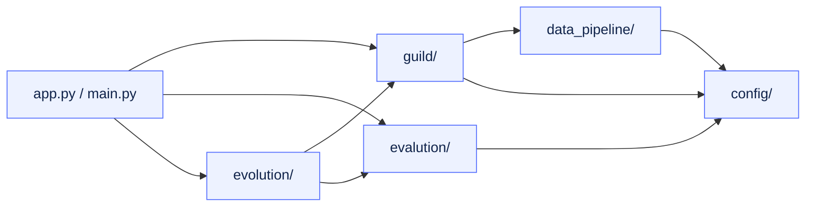

---

## 🔐 Data, privacy, and reproducibility

- 🌍 **External model processing:** Trial prompts, retrieved reference excerpts, generated SQL, and evaluation context may be sent to OpenAI through the configured LangChain clients. LangSmith tracing is configured by the environment loader when enabled. Review the relevant provider, institutional, and contractual terms before sending any sensitive information.
- 🏥 **Local clinical data:** MIMIC-III is handled locally by DuckDB in this application, but local processing does not by itself establish compliance with your institution's data governance requirements. Do not use identifiable patient information or upload restricted files to source control.
- 🧾 **Source provenance:** Retrieved documents carry source metadata into specialist findings, but the synthesizer is not a citation verifier and the current UI does not produce a formal evidence table or audit-grade provenance manifest.
- 🔁 **Reproducibility:** PubMed retrieval, remote model responses, hard-coded source URLs, and mutable upstream data can change. The current app does not persist a complete run configuration, source snapshot, prompt/model manifest, or random seed.
- 🗑️ **Data retention:** The gene pool is in memory, downloaded reference data is local under `data/`, and there is no project-level persistence or cleanup interface for experimental runs.

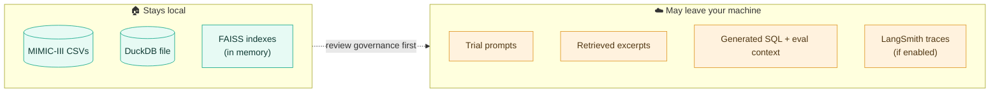

---

## ⚠️ Limitations and responsible use

This repository should be treated as an **early-stage research prototype**. Among the key limitations visible in the current implementation:

1. 🩺 **Not clinically validated.** Generated inclusion/exclusion criteria can omit contraindications, introduce unsupported thresholds, or misstate evidence. Human expert review is mandatory.
2. 📚 **Limited evidence coverage.** Sources are narrow and partially hard-coded; the ethics corpus is a short summary. Retrieval does not guarantee completeness, currency, or source triangulation.
3. 🧬 **Simplified cohort phenotype.** ICD and lab mappings in the SQL-generation prompt are approximations. They are not validated cohort definitions and may not represent a target trial population.
4. 🧨 **Generated SQL is executed.** The cohort analyst executes LLM-produced SQL against DuckDB with limited guardrails in the current code. Run only in a controlled environment against a trusted, appropriately scoped database; do not treat it as safe for arbitrary database inputs.
5. 📏 **Heuristic scores.** Feasibility and simplicity are simple proxies. LLM-as-judge scores can vary and are not independently validated or calibrated.
6. 🔧 **Workflow gaps.** Planner task dependencies are not enforced; agent dispatch is sequential; vector indexes are not persisted; pool state is not durable.
7. 🧩 **Configuration inconsistencies.** UI setup text references Ollama while the actual model factory uses OpenAI. CLI and UI also use different hard-coded FDA document URLs. Confirm and reconcile these before interpreting results.
8. 🧪 **Incomplete automated tests.** The repository includes an FDA download smoke test, but not a comprehensive unit, integration, or safety test suite.

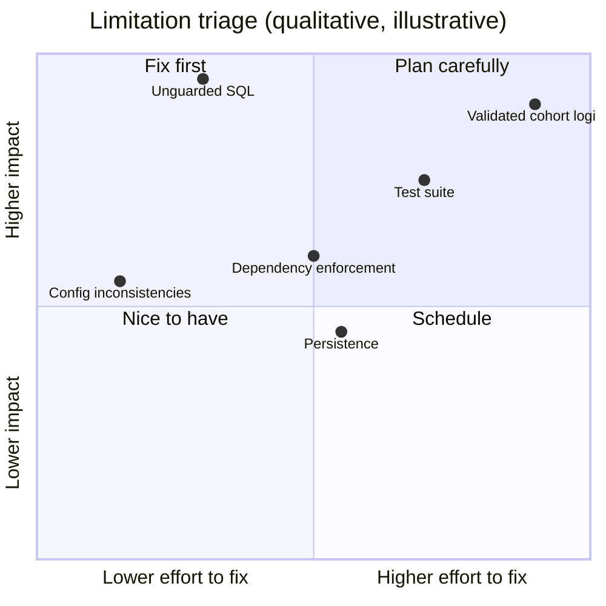

---

## 🗺️ Roadmap ideas

Potential improvements for a production-quality research platform include:

- 🧾 Add source/version manifests, citation-level grounding, and source freshness checks.
- 🛡️ Replace generated-SQL execution with a constrained query layer, read-only connection, allowlisted query templates, and explicit validation.
- 🧑‍⚕️ Validate cohort definitions with clinical informaticians and report uncertainty and denominator definitions.
- 🔧 Make sources, model providers, prompts, and retrieval settings explicit configuration rather than hard-coded constants.
- 💾 Add repeatable experiment IDs, persisted SOP versions, immutable evaluation records, and reproducibility metadata.
- 🔗 Enforce planner dependencies and introduce explicit retry, timeout, and failure-state handling.
- 📐 Benchmark each evaluator against expert-reviewed references and add calibration, inter-rater analysis, and regression tests.
- 🧪 Add unit/integration tests with synthetic fixtures and CI; add privacy/security review before broadening access.

```mermaid
flowchart LR
  subgraph NOW["📍 Now"]
    N1["Prototype workflow"]
    N2["Five-objective gauntlet"]
    N3["Pareto frontier view"]
  end
  subgraph NEXT["🔜 Next"]
    X1["Config-driven sources + models"]
    X2["Read-only constrained SQL"]
    X3["Tests with synthetic fixtures"]
  end
  subgraph LATER["🌅 Later"]
    L1["Persisted experiments + manifests"]
    L2["Dependency-aware scheduling"]
    L3["Calibrated, expert-benchmarked evaluators"]
  end
  NOW --> NEXT --> LATER

  classDef now fill:#e7faf4,stroke:#14a88a,color:#103b34;
  classDef next fill:#e9efff,stroke:#536dfe,color:#10234a;
  classDef later fill:#f2eaff,stroke:#9560d8,color:#32184d;
  class N1,N2,N3 now;
  class X1,X2,X3 next;
  class L1,L2,L3 later;
```

---

## 📖 Glossary

| 📚 Term | 💬 Meaning |
| --- | --- |
| **Guild** | The team of planner, specialist, and synthesizer agents that drafts criteria |
| **SOP** | Standard operating procedure: prompts and settings (e.g., retrieval `k`, enabled specialists, synthesizer model) that steer the Guild |
| **Gene pool** | In-memory collection of SOP versions with parent links and scorecards |
| **Gauntlet** | The five-objective evaluation applied to each draft |
| **Pareto frontier** | The set of SOPs not dominated by any other SOP across all objectives |
| **Dominance** | A is at least as good as B on all objectives and strictly better on at least one |
| **LLM-as-judge** | Using a language model to score a draft against retrieved context |
| **FAISS** | Vector similarity library used for in-memory retrieval indexes |
| **MIMIC-III** | Credentialed critical-care research database used for the cohort proxy |
| **Belmont Report** | Foundational research-ethics principles summarized as the ethics source |

---

## ❓ FAQ

<details>
<summary><b>🧑‍⚕️ Can I use the generated criteria in a real trial?</b></summary>

No. Outputs are prototype drafts and must be independently reviewed by qualified clinical, statistical, ethics, and regulatory experts before any research or operational use.
</details>

<details>
<summary><b>🧪 Can I use a different trial concept?</b></summary>

The UI accepts a trial concept, but the PubMed query, clinical-code mappings, and several assumptions are tailored to the Sotagliflozin example. Expect to change code and sources for other conditions.
</details>

<details>
<summary><b>🎯 Why is there no single "best" SOP?</b></summary>

Because the five objectives can conflict. The frontier shows non-dominated options; choosing among them is a human decision based on study priorities.
</details>

<details>
<summary><b>🔌 Can I use local models instead of OpenAI?</b></summary>

Not without code changes. The model factory currently instantiates OpenAI chat and embedding clients, even though the onboarding text mentions Ollama.
</details>

<details>
<summary><b>💾 Are my results saved?</b></summary>

No. The gene pool and run state live in memory / the Streamlit session. Only downloaded reference data and the DuckDB file persist under `data/`, and `pareto_frontier.png` is written by the CLI.
</details>

---

## 🤝 Contributing

Contributions are welcome! 🎉 Before proposing model, prompt, source, or scoring changes, document the expected behavior and add tests or evaluation fixtures where possible. Never include secrets, licensed/controlled datasets, patient records, or downloaded restricted content in a pull request.

```mermaid
flowchart LR
  F["🍴 Fork"] --> B["🌿 Branch"] --> C["🛠️ Change + tests/fixtures"] --> D["📝 Document expected behavior"] --> P["🚀 Pull request"]
  classDef step fill:#e9efff,stroke:#536dfe,color:#10234a;
  class F,B,C,D,P step;
```

---

## 📜 License

No license file was present in the repository at the time this README was prepared. Until a license is added by the project owner, do not assume that the code is available for reuse, modification, or redistribution under an open-source license.

<div align="center">

<br/>

**🧬 Built for exploring trade-offs, not hiding them. 🧬**

*Research prototype · Human expert review required · Not medical advice*

</div>